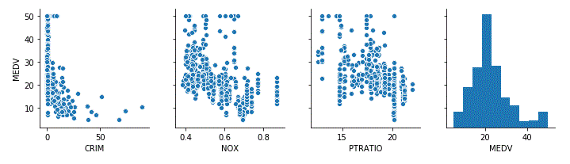
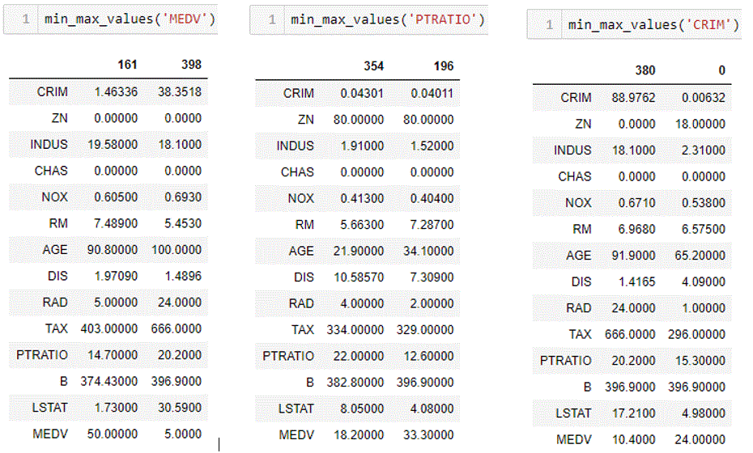
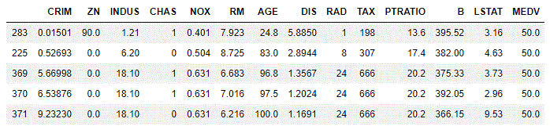
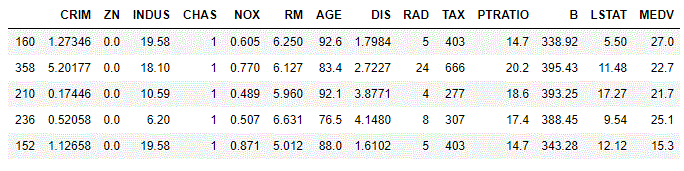
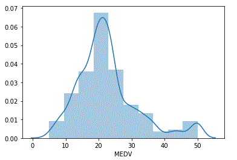
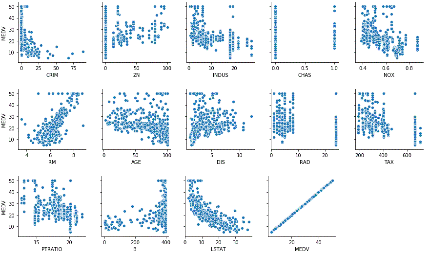

# Machine_Learning_Project
This repository contains an assessment of the 'Boston House Price' dataset for the 4th semester 5 credit module - Machine Learning & Statistics, part of the course entitled Higher Diploma in Science - Computing (Data Analytics), submitted to Dr. Ian McLoughlin, lecturer and Programme Administrator at GMIT. The analyses contained with this repository are as per the assignment direction and are answered in the order in which they were asked. A number of sources of reference material was used and reviewed in this analysis, and a list of referenced sites is found at the end of the page.
The analysis is carried out with the use of a Jupyter Notebook, which can be run directly in the git hub respository or downloaded, as preferred.  All the images in the note book are embedded using the recommended relative path to the 'Image' directory in the parent folder.  For convenience we have included a pdf version of our notebook, should the images fail to load.

13.12.19.

### Executive Report

#### Section 1  - Describe.
Use descriptive statistics and plots to describe the Boston House Price dataset.

The Boston House Price dataset was compiled by Harrison and Rubinfed in 1978 for the purpose establishing whether or not clean air influenced the value of houses in Boston.  They collected and analysed data under 14 categories.  For convenience we have listed the categories below.
1. CRIM - per capita crime rate per town
2. ZN - proportion of residential land zoned for lots over 25,000 sq.ft.
3. INDUS - proportion of non-retail business acres per town
4. CHAS - Charles River dummy variable (1 if tract bounds river; else 0)
5. NOX – nitric oxides concentration (parts per 10 million)
6. RM – average number of rooms per dwelling
7. AGE – proportion of owner-occupied units built prior to 1940
8. DIS – weighted distances to five Boston employment centres
9. RAD – index of accessibility to radial highways
10. TAX – full-value property-tax rate per per 10,000
11. PT - pupil teacher ratio by town
12. B – 1000(Bk - 0.63)^2 where Bk is the proportion of blacks by town
13. LSTAT - % lower status of the population
14. MEDV – Median value of owner-occupied homes in 1000’s.

We downloaded the dataset from the following [resource](https://github.com/selva86/datasets/blob/master/BostonHousing.csv).

We then viewed the dataset by importing it as a dataframe using the pandas package for data analytics. With the benefit of having named the categories in line with the instructions, we did preliminary checks to see that the dataset we had obtained was complete and intact. 

We confirmed this using the dataframe 'info' function.

We then checked for duplicates and run some decriptive analyitics on the data to get a view of the distributions etc.

  
We used the matplotlib and seaborn libraries to illustrate plots of all data for comparison using pairplot.  However given the 14 categories of data this was useful to pick out some categories that we could investigate futher.

Having viewed full set of plots, we selected a subset of the data which we thought was interesting to see if we could detect correlations from graphs.

We can clearly see from the plots the MEDV category is higly influenced by factors such as crime, but not so by NOX values and less so by pupil-teacher ratios.
To investigate the dataset further we analysed the maximum and minimum values for each of 'MEDV', 'PTRATIO', and 'CRIM'.

From the analysis above we made the following observations;
1. The max MEDV occurs where crime is very low and the contrary value holds true.
2. The tax rate is lower for the highest MEDV than the lowest MEDV.
3. PTRATIO max and min values have equal crime rates, NOx emmissions, and Tax values.
4. For crime min and max values, high levels of industry and retail businesses reflect high crime rates, and access to highways. 
5. The Charles River variable was 'zero' for all max and min values in the subset of data we looked at.

We then sorted the data selecting the top values for MEDV to see if we could see a trend in the data.

This was inconclusive as we see variances in the data for the other variables, other than the crime variable which is only consistenly low for high MEDV values.
We sorted the dataset on the Charles River variable to see what was returned where the variable indicated proximity to the river.

We note a relative spread of values and in particular the MEDV values are close to the mean of the distribution.  We then analysed this futher by plotting the distribution of the MEDV data.

To view the relationship between the MEDV value and the other 13 categories we plotted the values for the complete data, so as to not skew the values (as would be inferred from our discrete selections above e.g. max/min). 

The correlation between MEDV and CRIM and LSTAT, are noted by the downward trending graphs indicating a negative correlation. Other variables such as NOX, RAD, AGE do not indicate any correlation.

#### Section 2 - Infer.
Use inferential statistics to analyse whether there is a significant difference between median house prices for houses along the Charles River and those that are not.

We analysed the Charles River data and found that the data was somewhat skewed in favour of properties not bounding the river. We note that the instances of houses bounding the river numbers 35, whereas the number of properities not bounding the river in the dataset is 471. Therefore the sample dataset has a bias as the population quantum for median house prices is over 13 times larger for properties not bounding the Charles River than those that are.

Now that we understand that there is a bias in terms of the population size, and that the relative size of the sub-groups may influence a determination, we looked at the distributions of the data sub-categorised by the Charles River dummy variable.  To visualise this we used a box-plot to illustrate the middle 50 percent of the data values, also known as the interquartile range. The median of the values is depicted by the line splitting the box in half. The IQR illustrates the variability in a set of values. A large IQR indicates a large spread in values, while a smaller IQR indicates most values fall near the center. Box plots also illustrate the minimum and maximum data values through whiskers extending from the box, and outliers as points extending beyond the whiskers.[Ref](https://pro.arcgis.com/en/pro-app/help/analysis/geoprocessing/charts/box-plot.htm)

Outliers are plotted as individual data points. These are individual data points that are beyond the max or min values are could be considered as erroneous values, subject to further investigation.

The box-and-whisker plot is useful for revealing the central tendency and variability of a data set, the distribution (particularly symmetry or skewness) of the data, and the presence of outliers. It is also a powerful graphical technique for comparing samples from two or more different treatments or populations.

From a comparison of the two boxplots above, we note that the median values (MEDV) are relatively similar, but that we see a greater variablility in the interquartile range for houses bounding the Charles River.  However, this is due to the inherent assumption in the box-plot that the house values above approximately \\$36,000 are to be considered as outliers.  Given that we consider this dataset to be a factual respresenation of data collected we cannot therefore exclude the 'outliers'.  

To further analyse this we will need to plot the distributions of the subsets using a histogram to provide a more accurate representation of the distribution, without exclusions. 

The histogram's provide a much more accurate respresention of the subsets.  We can clearly see that within both populations, we have a range house price values that are similar.  In both populations we can see that the overall distribution is similar and that within each we can identify a 'bin' of house prices we roughly estimate between \\$43,000 and \\$50,000.  Due to the relative size of the populations, the influence of a single bin of the high MEDV houses is more profound in the dataset for houses bounding the Charles River. 

When we overlay the histograms, we see that the distribution and probability density functions are relatively similar for house bounding the Charles river and those that do not.  

We ran a 'T-Test' to confirm our obsverations.

The resultant value was below our predetermined level to consider the Null Hypothesis as void, although this would need further investigation which is beyond the scope of this report, it assists us in making our determination.

In conclusion we find that there is not a significant difference in median house prices for houses along the Charles River and those that are not.

#### Section 3 - Predict.
Create a neural network that can predict the median house price based on the other variables in the dataset.

For the purpose of efficient building, training and testing of multiple neural networks we imported the Keras library.
Due to its structure, we can build a neural network or multiple versions of a network with various selections of cost functions, optimisers, activation functions, and as many internal and hidden layers as we choose.  For the purpose of this report we will design our neural network model by running scenarios where we change one of the following inputs for each run;  Activation Function, Loss Function, and Optimiser.  Having selected the Input dataset (i.e. all categories except the MEDV) and the Output dataset (i.e the MEDV category) we then follow the following process to select the functions which give us the least error, defined by percentage difference over our target (known) value.

We use the following acronyms aoove;
Mean Square Logarithmic Error (MSLE), Mean Square Error (MSE), Mean Absolute Error (MAE), Stochastic Gradient Descent (SGD), Rectified Linear Unit (ReLU).
Based on the results obtained from multiple runs of the model, we choose 'Relu' as the most appropriate activation function, Mean Square Error for the loss function and adagrad as the Optimiser.

Based on the selected design and from multiple runs of the neural network, the predicted value error was between 1\% and 7\%. 

For the model building exercise, we incorporated the full dataset in selecting the most suitable functions.  However, to investigate whether or not a subset of the dataset would produce a more accurate result, we removed 'CHAS', 'AGE', 'B', from the input dataset.

The result obtained from modelling the subset of data was an improved result (i.e. <1\%) over the prediction error obtained when using the full dataset.  We therefore conclude that this dataset can be optimised by removing unnecessary categories.

We then reduced the dataset further by additionally removing the following categories: 'CRIM', 'INDUS', 'NOX'. 

The reduced subset returned a negligable improvement over the previous iteration of the model run and we consider that the datset reduction is sufficient. 

However, although the results obtained above had a very small level of error, we considered whether or not a pre-processed dataset would improve the result.  For this we normalised, scaled and used data whitening on the full dataset.  The purpose of whitening was to remove the influenece of correlation.  For this task we imported the pre-processing libary from SciKit-Learn.  We re-ran the model using the same input/output functions as adopted earlier,however we elected to let the model use 20\% of the data for self training purposes.

However, the accuracy of our neural network decreased with the application of pre-processing and or self-training.

As a confirmation of the findings obtained from the latest run of the model (i.e. pre-processed), we then did a model run to predict the top 5 and bottom 5 MEDV values, by list order as we considered this equivalent to a random selection of variables.

However, the results obtained were less accurate than for the single layered output.  A further investigation of the dataset would be required to establish the optimum parameters for multi layered output scenarios.

In conclusion, we found that the dataset did not require preprocessing to achieve the best prediction result.  The optimum prediction was generated consistently from a sub-set of data.  The level of accuracy using a simplified algorithm to select the input parameters proved to be high and consistent when we targeted one a layered output.  The level of accuracy deteriorated for greater numbers of output layers, however this would need to be analysed further to confirm whether or not our input parameters are suitable for this approach.

